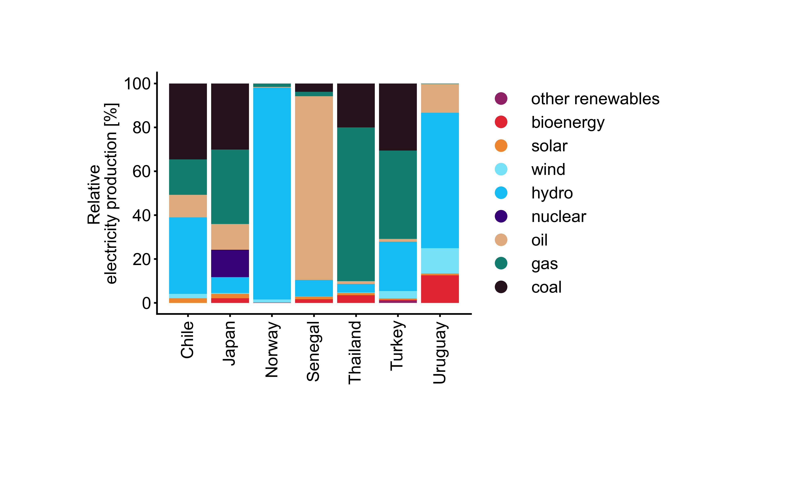

# Stacked Bar Plot
Script to generate a a stacked bar plot. The plot uses the electricity production dataset for demonstration.

The dataset used for demonstration is featured in the following references:

- [Ritchie, H., & Rosado, P. (2020). Electricity mix. Our world in data.](https://ourworldindata.org/electricity-mix?gsid=5aa1a303-5872-479b-ab4b-042d60cd9684)
- [Global Energy Mix & Generation Sources (1985-2023)](https://www.kaggle.com/datasets/shreyasur965/hgfgfdgdsa)

installation:

```bash
pip install -r requirements.txt
```

usage:

```bash
python stacked_bar_plot.py
```

Cite As

[Nzakimuena, C. B., Solano, M. M., Marcotte-Collard, R., Lesk, M. R., & Costantino, S. (2025). Spatial and temporal changes in choroid morphology associated with long-duration spaceflight. Investigative Ophthalmology & Visual Science, 66(5), 17-17.](https://doi.org/10.1167/iovs.66.5.17)

